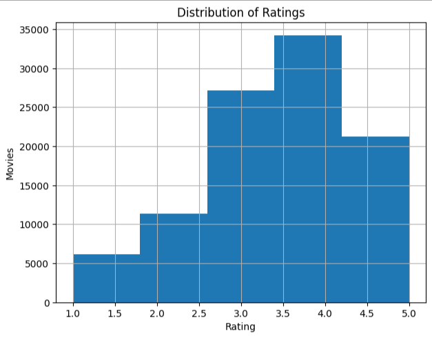
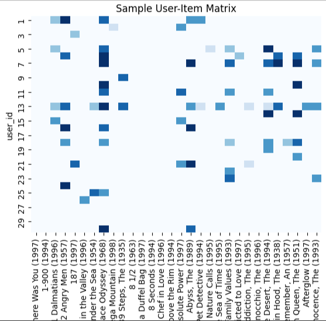

# Movie Recommendation System (MovieLens 100K Dataset)

This project implements different recommendation system approaches such as `User-based CF`, `Item-based CF`, `SVD (matrix factorization)`.  
The goal is to recommend movies to users based on their past ratings and evaluate the system using **Precision@K**.

# Project Overview
Recommender systems are widely used in platforms like Netflix, YouTube, Amazon, and Spotify.  
In this project, I explored and compared three major approaches:

1. **User-based Collaborative Filtering (CF)** – recommends movies based on similar users.  
2. **Item-based Collaborative Filtering (CF)** – recommends movies based on similar movies.  
3. **Matrix Factorization (SVD)** – decomposes the user–item matrix into latent factors.  

Each approach was evaluated using **Precision@K**.

# Tools & Libraries
- Python  
- Pandas, NumPy  
- Scikit-learn  
- Matplotlib  

# Dataset
- **Source:** https://www.kaggle.com/datasets/prajitdatta/movielens-100k-dataset
- MovieLens 100K Dataset (100,000 ratings from 943 users on 1682 movies).
- This data set consists of:
    * 100,000 ratings (1-5) from 943 users on 1682 movies.
    * Each user has rated at least 20 movies.

# Average Precision@k of each model
-----------------------------------------------------
| Model                         | Precision@5 (k=5) |
|-------------------------------|-------------------|
| User-based CF                 | 0.24              |
| Item-based CF                 | 0.10              |
| Matrix Factorization (SVD)    | 0.30              |
-----------------------------------------------------

# Ratings Distribution
Show how many movies have been rated 1–5 stars.

# Heatmap of User–Item Matrix (sample)
Shows sparsity of ratings – most users rate only a few movies.

# Top 10 most Rated movies

